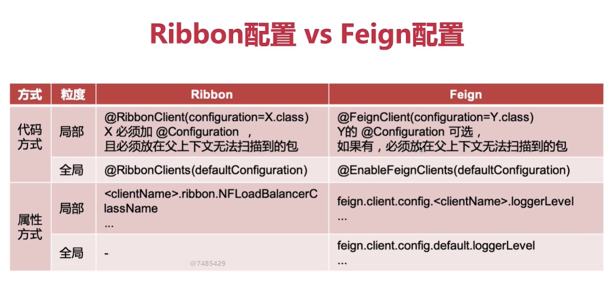
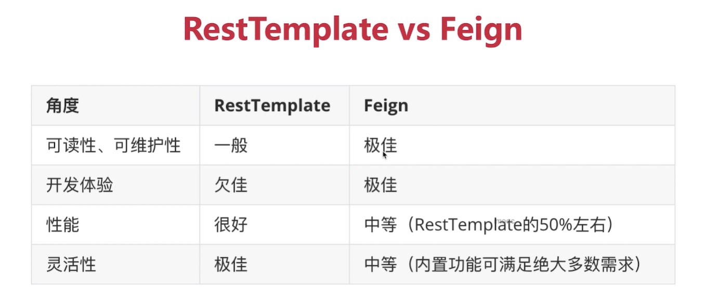

# content
springcloud项目: 内容中心
## Feign
### ribbon方式 vs feign方式

### feign代码方式 vs 属性方式
##### 配置优先级：全局代码<全局属性<细粒度代码<细粒度属性
##### java配置优势：基于代码，更加灵活
##### 属性配置优势：易上手，配置直观，优先级更高
总结：尽量使用属性配置，属性方式实现不了的情况下再考虑用代码配置
### restTemplate方式 vs feign方式

总结：尽量使用feign，特殊情况在考虑用restTemplate
### feign性能优化方式
##### 1.配置连接池
##### 2.设置合适的日志级别（开发可以设置成full,生产还是建议设置成basic）
## Sentinel
### 基于调用关系的流量控制
同一个资源名可以配置多条规则，规则的生效顺序为：指定微服务 > other > default
### 服务容错方式
##### 1.超时
##### 2.限流
##### 3.仓壁模式
##### 4.断路器模式
### 流控模式
##### 1.直接 设定指定阈值，达到阈值之后限流
##### 2.关联 设置关联接口，当关联接口达到指定阈值之后，限制被关联接口的访问，从而起到保护关联接口的作用
##### 3.链路 只记录指定链路上的流量，链路可以简单的理解为是细粒度的针对来源，是针对接口层面的
### 流控效果
##### 1.快速失败：直接抛异常
##### 2.Warm Up：根据codeFactor也叫作冷加载因子（默认3）的值，从阈值/codeFactor，经过预热时长，才打到设置的QPS阈值（源码WarmUpController）
##### 3.排队等待：匀速排队，让请求以均匀的速度通过，阈值类型必须设置为QPS，设置成线程无效
### 降级规则（其实也就是断路器模式）
##### 慢调用比例 (SLOW_REQUEST_RATIO)：选择以慢调用比例作为阈值，需要设置允许的慢调用 RT（即最大的响应时间），请求的响应时间大于该值则统计为慢调用。当单位统计时长（statIntervalMs）内请求数目大于设置的最小请求数目，并且慢调用的比例大于阈值，则接下来的熔断时长内请求会自动被熔断。经过熔断时长后熔断器会进入探测恢复状态（HALF-OPEN 状态），若接下来的一个请求响应时间小于设置的慢调用 RT 则结束熔断，若大于设置的慢调用 RT 则会再次被熔断。
##### 异常比例 (ERROR_RATIO)：当单位统计时长（statIntervalMs）内请求数目大于设置的最小请求数目，并且异常的比例大于阈值，则接下来的熔断时长内请求会自动被熔断。经过熔断时长后熔断器会进入探测恢复状态（HALF-OPEN 状态），若接下来的一个请求成功完成（没有错误）则结束熔断，否则会再次被熔断。异常比率的阈值范围是 [0.0, 1.0]，代表 0% - 100%。
##### 异常数 (ERROR_COUNT)：当单位统计时长内的异常数目超过阈值之后会自动进行熔断。经过熔断时长后熔断器会进入探测恢复状态（HALF-OPEN 状态），若接下来的一个请求成功完成（没有错误）则结束熔断，否则会再次被熔断。
### 热点规则
##### 可以理解为是特殊的流控规则，针对于参数去做限制甚至于可以针对参数的某个具体值做限制。参数类型需要是基本数据类型或者是String
### 系统规则
##### Load 自适应（仅对 Linux/Unix-like 机器生效）：系统的 load1 作为启发指标，进行自适应系统保护。当系统 load1 超过设定的启发值，且系统当前的并发线程数超过估算的系统容量时才会触发系统保护（BBR 阶段）。系统容量由系统的 maxQps * minRt 估算得出。设定参考值一般是 CPU cores * 2.5。
##### 平均 RT：当单台机器上所有入口流量的平均 RT 达到阈值即触发系统保护，单位是毫秒。
##### 并发线程数：当单台机器上所有入口流量的并发线程数达到阈值即触发系统保护。
##### 入口 QPS：当单台机器上所有入口流量的 QPS 达到阈值即触发系统保护。
##### CPU usage（1.5.0+ 版本）：当系统 CPU 使用率超过阈值即触发系统保护（取值范围 0.0-1.0），比较灵敏。
### 授权规则
##### 根据资源的请求来源（origin）限制资源是否通过，若配置白名单则只有请求来源位于白名单内时才可通过；若配置黑名单则请求来源位于黑名单时不通过，其余的请求通过。
### sentinel规则持久化方案
##### sentinel官方文档：https://github.com/alibaba/Sentinel/wiki/%E5%9C%A8%E7%94%9F%E4%BA%A7%E7%8E%AF%E5%A2%83%E4%B8%AD%E4%BD%BF%E7%94%A8-Sentinel
##### 拉模式：https://www.imooc.com/article/289402
##### 推模式：https://www.imooc.com/article/289464